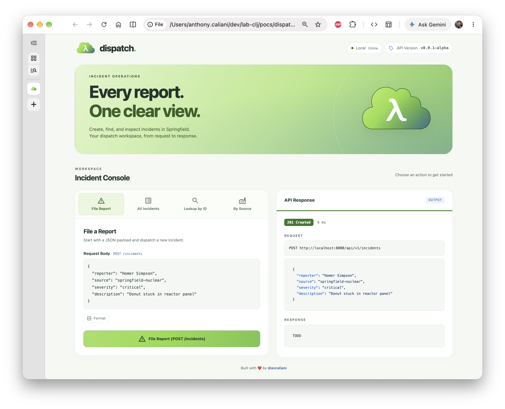

<div align="center">

# `dispatch-ui`

An incident console for [dispatch-api](../dispatch-api).<br>
Create reports, explore incidents, and inspect every request and response.


[Quick Start](#quick-start) · [Requested URLs](#requested-urls) · [Configuration](#configuration) · [Dispatch API](../dispatch-api/README.md)

</div>

---

## Quick Start

A static page with no build step.  
Start [`dispatch-api`](../dispatch-api/README.md), then open the console.

From `pocs/dispatch-ui`, start the API in one terminal:

```bash
# Start the API
cd ../dispatch-api && lein run

# Open the HTML
open index.html
```



## Requested Endpoints

| Action | Endpoint |
|:---|:---|
| **Version and Environment** | `GET /api/version` |
| **File Report** | `POST /api/v1/incidents` |
| **All Incidents** | `GET /api/v1/incidents` |
| **Lookup by ID** | `GET /api/v1/incidents/:id` |
| **By Source** | `GET /api/v1/incidents?source=<src>` |

## Configuration

| Constant | Default | Location |
|:---|:---|:---|
| `API_URL` | `http://localhost:8080/api` | [`app.js`](app.js) |
| `BASE_URL` | `${API_URL}/v1` | [`app.js`](app.js) |

### Libraries

- [Alpine.js](https://alpinejs.dev/): reactive state and interactions.
- [highlight.js](https://highlightjs.org/): JSON syntax highlighting.
- [Material Symbols](https://fonts.google.com/icons): interface icons.
